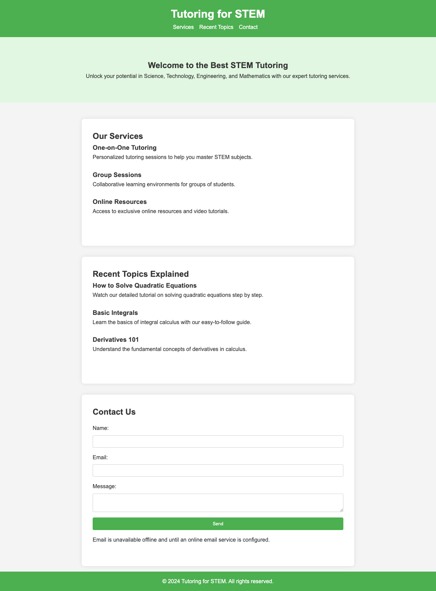
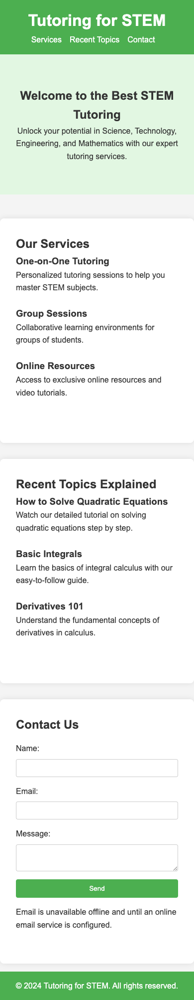

# Tutoring for STEM

A tutoring landing page presenting STEM tutoring services, recent topics, and a contact form. The Angular site preserves the original green design and navigation.

## What you can do

- Read about one-on-one tutoring, group sessions, and online resources.
- Browse recent topic examples.
- Use the contact form with name, email, and message validation.

## Preview



Captured from the running application on September 30, 2026. Any sample records shown are demonstration or isolated test data, not data included with a fresh installation.

<details>
<summary>Mobile view</summary>



</details>

## Run locally

Use the Node version in `.nvmrc` (currently 26.10.0) and npm. Run these commands from the repository root.

```sh
nvm use  # if you manage Node with nvm
npm ci
npm start
```

Open [http://127.0.0.1:4200](http://127.0.0.1:4200). Keep the server in the foreground; stop it with **Ctrl+C**.

## Current scope

Contact email is disabled by default. To enable it, configure `src/email-config.ts` with your own EmailJS public key, service ID, and template ID; use the template variables `name`, `email`, and `message`. Never add private keys to frontend source. Without configuration or connectivity, the form retains the message and explains that delivery is unavailable. The former static source is in `legacy-static/`.

## Development

```sh
npm run build
npm run typecheck
npm test -- --browsers=ChromeHeadless
```

Browser tests require Chrome or Chromium; set `CHROME_BIN` if it is outside the standard installation path. Angular 22 currently requires TypeScript 6.0.x. The Jasmine 6 test dependencies are retained for compatibility with Zone.js.
